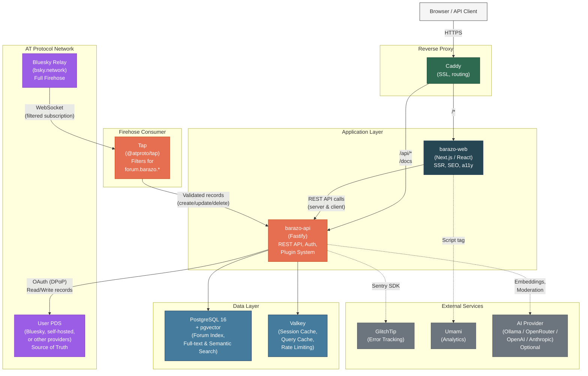
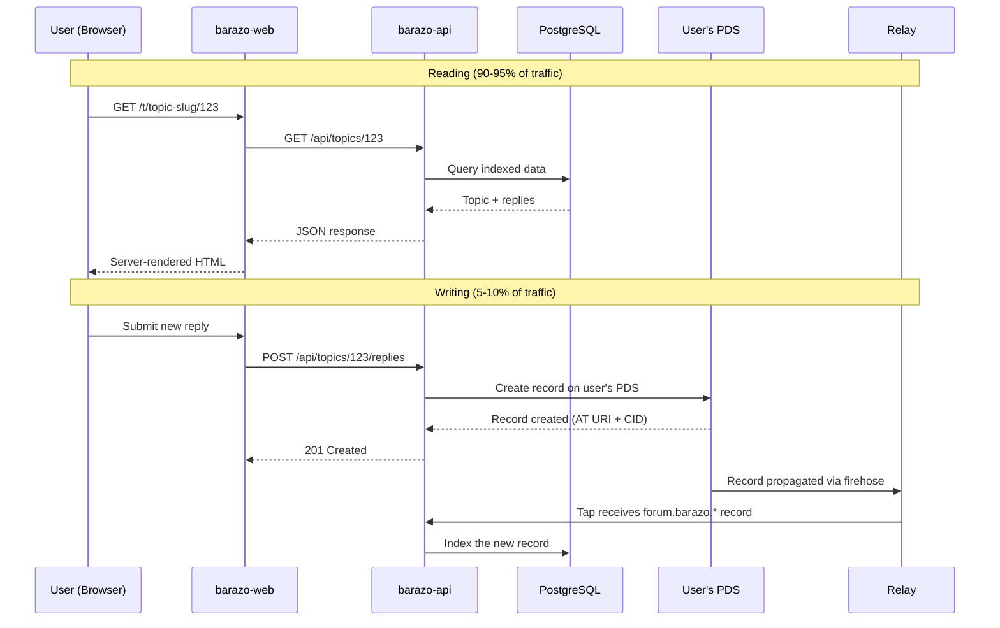
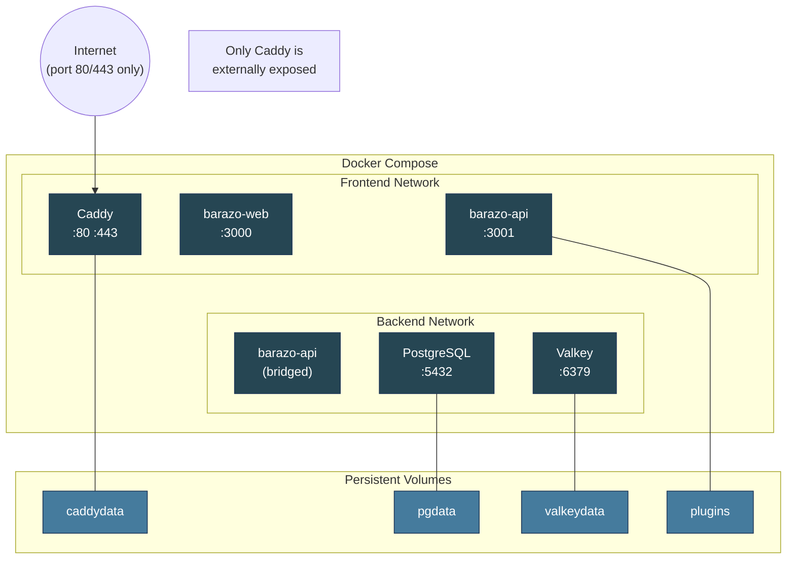
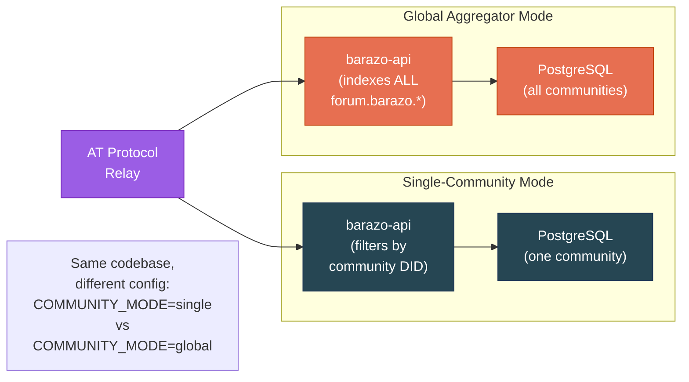

# Barazo Architecture Overview

## System Architecture

## Data Flow

## Deployment Architecture

## Operating Modes

## Hosting Tiers

| Tier | Frontend | Backend (AppView) | Cross-Community | Cost |
|------|----------|-------------------|-----------------|------|
| **Fully Managed** | Barazo hosts, your custom domain | Barazo central AppView | Automatic | Paid (EUR 19-99/mo) |
| **Custom Frontend** | You host barazo-web | Barazo central AppView API | Automatic | Lower paid |
| **Fully Self-Hosted** | You host | You host | Optional (via global API) | Free (AGPL) |

Migration between tiers is lossless -- user content lives on their PDS, not on servers.

## Key Differentiators vs. Traditional Forums

| Feature | Traditional (Discourse/Flarum) | Barazo |
|---------|-------------------------------|--------|
| Data ownership | Server stores all data | Users own data on their PDS |
| Identity | Per-forum accounts | Portable AT Protocol identity |
| Reputation | Per-forum only | Cross-community, portable |
| Migration | Export/import, lose identity | Change server, keep everything |
| Cross-instance | Not possible | Global aggregator built-in |
| Plugins | Server-side only | Can define portable Lexicon schemas |

## Tech Stack Summary

| Layer | Technology |
|-------|-----------|
| **Frontend** | Next.js 16, React 19, TailwindCSS, Radix Colors, Phosphor Icons |
| **Backend** | Fastify, TypeScript, Drizzle ORM, Zod validation |
| **Protocol** | @atproto/api, @atproto/oauth-client-node, @atproto/tap |
| **Database** | PostgreSQL 16 + pgvector, Valkey |
| **Infrastructure** | Docker Compose, Caddy, Hetzner VPS, Bunny.net CDN |
| **Monitoring** | GlitchTip (errors), Pino (logs), Umami (analytics) |
| **CI/CD** | GitHub Actions, GHCR (container registry) |
